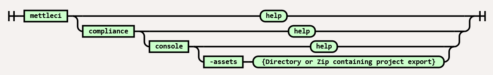

# Compliance Console Command

|                 |            |
|-----------------|------------|
| **Namespace**   | compliance |
| **Command**     | console    |
| **Plugin Name** | compliance |

This documentation page is a preview of upcoming NextGen functionality -
it currently has viewing restrictions enabled with the
 icon to indicate that it is purefly for reference
by Data Migrators engineers.

**DO NOT CHANGE THE VIEWING RESTRICTIONS OF THIS PAGE!**

# Purpose

The Compliance Console is a <a
href="https://en.wikipedia.org/wiki/Read%E2%80%93eval%E2%80%93print_loop"
rel="nofollow">REPL</a>-like shell which allows easy access to evaluate
and explore Compliance Rule and Asset Query expressions. It is designed
to serve the following use cases:

-   A learning tool - for new users that want to learn how to write
    Compliance Rules and Asset Queries

-   Development aid - that provides fast iteration loops while
    developing new Compliance Rules and Asset Queries

-   Ad-hoc Analysis and Exploration - to discover features of assets
    that may be of interest for future Compliance Rules and Asset
    Queries

# Syntax



# Using the Console

After launching the Compliance Console, you will be presented with the
compliance input prompt:

``` java
      ((((((((#%#%#%#          _____                      _ _
    (((    ###((    ###       / ____|                    | (_)
  /((     #%#  ((     #%#    | |     ___  _ __ ___  _ __ | |_  __ _ _ __   ___ ___
  ((     ##*    ((     ###   | |    / _ \| '_ ` _ \| '_ \| | |/ _` | '_ \ / __/ _ \
 (((#####%#     (((     #%   | |___| (_) | | | | | | |_) | | | (_| | | | | (_|  __/
                 ((     ##/   \_____\___/|_| |_| |_| .__/|_|_|\__,_|_| |_|\___\___|
                 (((###%#%#                        | |
                                                   |_|
compliance>
```

You can type valid
<a href="https://groovy-lang.org/" rel="nofollow">Groovy</a> expressions
at the input prompt and the console will attempt to evaluate the
results:

``` java
compliance> println "hello world!"
hello world!
==>null
```

As can be seen in this example, the `println` expression will result in
`hello world!` being displayed to screen. The console will also attempt
to evaluate the value returned by this expression and will display the
results using the result prompt `==>`. In this example, `println` does
not return any value so the compliance console displays `null`.

Another simple expression which evaluates to a non-null result can be
seen below:

``` java
compliance> (1+2+3)*4
==>24
```

Expressions can also be assigned to variables that remain available for
use in all proceeding expressions:

``` java
compliance> myValue = 4*3
==>12
compliance> myValue
==>12
compliance> (myValue * myValue) / 2
==>72
```

To simulate the `item` variable which is available during Compliance
Rule or Asset Query execution, the compliance console exposes the
`assets` object which can be used to load an asset from the repository
specified when launching the compliance console:

``` java
compliance> item = assets.load("data_intg_flow", "MyDataStageFlow")
==>com.datamigrators.mettle.compliance.model.Flow@7793ad58
```

This expression loads a DataStage flow called `MyDataStageFlow` into the
variable `item`. The loaded asset can then be accessed just like in
Compliance Rules or Asset Queries:

``` java
compliance> item.name
==>MyDataStageFlow
compliance> item.graph.V().stage().values("stageName")
==>Row_Generator_1
==>Peek_1
==>Transformer_1
```

**Tip**

`assets.types` can be used to list all asset types supported by MettleCI
Compliance and `assets.list(<type>)` can be used to display the names of
all assets of the specified type.

In addition to Groovy expressions, the compliance input prompt will also
accept a set of “commands” which provide rich access to the console’s
environment. Documentation for all available commands can be accessed
within the console itself with the `:help` command:

``` java
compliance> :help
Available commands:
  :help        (:h ) Display this help message
  ?            (:? ) Alias to: :help
  :exit        (:x ) Exit the shell
  :quit        (:q ) Alias to: :exit
  import       (:i ) Import a class into the namespace
  :display     (:d ) Display the current buffer
  :clear       (:c ) Clear the buffer and reset the prompt counter
  :show        (:S ) Show variables, classes or imports
  :purge       (:p ) Purge variables, classes, imports or preferences
  :edit        (:e ) Edit the current buffer
  :save        (:s ) Save the current buffer to a file
  :record      (:r ) Record the current session to a file
  :history     (:H ) Display, manage and recall edit-line history
  :alias       (:a ) Create an alias
  :doc         (:D ) Open a browser window displaying the doc for the argument
  :set         (:= ) Set (or list) preferences
  :cls         (:C ) Clear the screen.
  :compliance  (:cr) Show or clear Compliance results
  :query       (:aq) Show or clear Asset Query results

For help on a specific command type:
    :help command
```

# Use Case: A learning Tool

The interactive nature of a REPL makes it possible to quickly try some
Compliance code and get some notion of success or failure without the
longer process of Compliance execution. The faster that you can iterate
through version of your Compliance code, the faster you can advance your
knowledge.

Compliance Rules and Asset Queries are written in Groovy but most
non-trivial rules and queries will leverage Gremlin graph traversals.
The official <a href="https://tinkerpop.apache.org/docs/current"
rel="nofollow">Apache Gremlin documentation</a> is an excellent
reference when first starting out includes many code samples written for
use with Gremlin “console”. These snippets, including references to
`TinkerrFactory`, can be run directly in the Compliance console.

# Use Case: Development Aid

Compliance Rules and Asset Queries are compiled and executed while
running Compliance, no additional IDEs or compilers are required. This
is very convenient when first getting started but can become challenging
when you need to test or debug complex Rules or Queries. The Compliance
Console is designed to work along side your text editor of choice to
enhance development productivity. Copying and pasting snippets and
traversals into the Compliance console as you work will allow you to:

-   Quickly test traversals over read DataStage assets to determine if
    they are correct

-   Test or debug pieces of traversals in isolation

-   Experiment with different ways of expressing the same traversals

# Use Case: Ad-hoc Analysis and Exploration

Sometimes you know the compliance tests you need to implement but aren’t
sure where to find the relevant properties within an Asset model.
Writing ad-hoc expressions and graph traversals can help inspect the
data present in an Asset Model and determine how your compliance test
should work. Below are some useful methods and examples for inspecting
the content of an Asset model.

## Inspecting Object Properties

All Objects within Groovy support the `.getProperties()` method which
can be written as `.properties` for short. This method will return all
properties of the object as key-value pairs representing the name of
each property and its value.

For example:

``` java
compliance> item = assets.load("data_intg_flow", "MyExampleFlow")
==>com.datamigrators.mettle.compliance.model.Flow@68dd39d2
compliance> item.properties
==>parameters={BatchDate=com.datamigrators.mettle.nextgen.schema.datastagemodel.Parameter@991cbde, RunId=com.datamigrators.mettle.nextgen.schema.datastagemodel.Parameter@78d71df1}
==>class=class com.datamigrators.mettle.compliance.model.Flow
==>graph=datastagetraversalsource[tinkergraph[vertices:7 edges:6], standard]
==>assetType=data_intg_flow
==>name=MyExampleFlow
```

Here you can see that a `data_intg_flow` has `parameters`, `class`,
`graph`, `assetType` and `name` properties available. In this case,
`parameters` contains a set of key-value pairs representing Flow
parameters. You can use the same `.properties` method for deeper
inspection of these parameters:

``` java
compliance> item.parameters.BatchDate.properties
==>value=null
==>validValues=null
==>type=date
==>class=class com.datamigrators.mettle.nextgen.schema.datastagemodel.Parameter
==>prompt=BatchDate
==>description=Start date of batch execution
==>subtype=null
==>name=BatchDate
```

## Inspecting Graph Elements

Use the `.elementMap()` Gremlin step to inspect the properties available
for given Graph Element (Vertices or Edges)

``` java
compliance> assets.load("data_intg_flow", "MyExampleFlow")
==>com.datamigrators.mettle.compliance.model.Flow@68dd39d2
compliance> item.graph.V().stage().elementMap()
==>[id:0,label:vertex,stageName:SegmentAttribute,stageType:DB2ConnectorPX,type:stage,nodeType:binding
==>[id:39,label:vertex,stageName:Copy_ofSegmentAttribute,stageType:PxSequentialFile,type:stage,nodeType:binding
==>[id:14,label:vertex,stageName:TX_Timestamp,stageType:CTransformerStage,type:stage,nodeType:execution_node
```

## Attachments:


[image-20230411-045157.png](attachments/2422341633/2422538241.png)
(image/png)  
