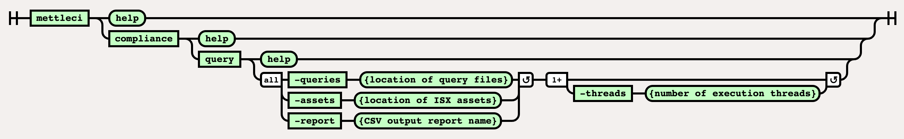

# Compliance Query Command

This page is for running MettleCI **ASSET QUERIES**.  If you're looking
for the Compliance Results typically returned by MettleCI Workbench then
please see
the <a href="Compliance_Test_Command" data-linked-resource-id="408322069"
data-linked-resource-version="29"
data-linked-resource-type="page">Compliance Test Command</a>.

# Purpose

The command line implementation of the Compliance Query functionality
exposes the low-level mechanism to produce a report listing the results
of the specified Asset Queries.

# Syntax



# Example

This example demonstrates how to export a set of ISX files and run Asset
Queries against them. Note that asset paths specification in the export
command uses the
<a href="https://www.ibm.com/docs/en/iis/11.7?topic=command-asset-paths"
rel="nofollow">same wildcard rules</a> as the `istool` command.

``` bash
# ============================== 
# Export the required ISX assets
# ============================== 
C:\> mettleci isx export ^
     -domain myteam-svcs.corp.com:59445 ^
     -username myuser -password mypassword ^
     -server myteam-engn.corp.com ^
     -project myproject ^
     -jobname .*LD_S.*
Exporting [.*LD_S.*] from repository...
Exporting DataStage assets...
 * Export 'test2-engn.datamigrators.io/myproject/Jobs/Load/LD_SUPPLIER.pjb' - COMPLETED
 * Export 'test2-engn.datamigrators.io/myproject/Jobs/Load/LD_STOCK_HOLDING.pjb' - COMPLETED
 * Export 'test2-engn.datamigrators.io/myproject/Jobs/Load/LD_STOCKITEM.pjb' - COMPLETED
 * Export 'test2-engn.datamigrators.io/myproject/Jobs/Load/LD_SALE.pjb' - COMPLETED
Export complete

# ================================================================
# Run the specified asset queries against the exported ISX assets
# ================================================================
C:\> mettleci compliance query \
     -assets ./Jobs \
     -queries ./Queries \
     -report compliance.csv \
MettleCI Command Line (build 122)
(C) 2018-2020 Data Migrators Pty Ltd

 <SNIP>

# Done!

C:\>
```

## Attachments:


[image-20220609-005054.png](attachments/458556115/2224390293.png)
(image/png)  

[image-20220609-005121.png](attachments/458556115/2224554088.png)
(image/png)  

[image-20220609-010535.png](attachments/458556115/2225537083.png)
(image/png)  

[image-20220609-082424.png](attachments/458556115/2227077196.png)
(image/png)  
