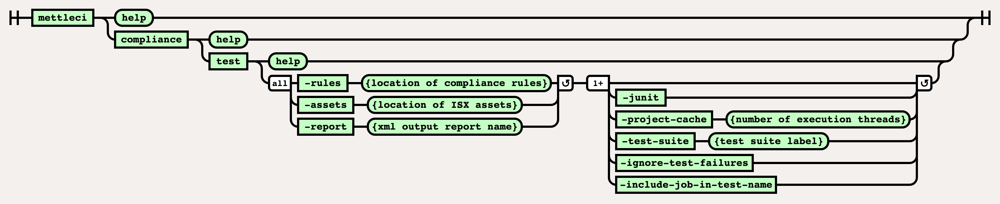

# Compliance Test Command

This page is for running MettleCI **COMPLIANCE RULES**.  If you're
looking for the Asset Queries typically used in a MettleCI Report Card
then please see the <a
href="https://datamigrators.atlassian.net/wiki/pages/resumedraft.action?draftId=458556115"
rel="nofollow">Compliance Query Command</a>.

# Purpose

The command line implementation of the Compliance Test functionality
enables the production of a Compliance Results report of the specified
assets against the specified set of <a href="Compliance_Rules_Reference"
data-linked-resource-id="2213085185" data-linked-resource-version="11"
data-linked-resource-type="page">MettleCI Compliance Rules</a>.

For more information on using the `-project-cache` parameter see our <a
href="https://datamigrators.atlassian.net/wiki/spaces/MCIDOC/pages/1356890161/MettleCI+CLI+and+the+project-cache+directory"
rel="nofollow">detailed explanation</a>.

# Syntax



# Example

This example demonstrates how to export a set of ISX files and run
Compliance against them. Note that asset paths specification in the
export command uses the
<a href="https://www.ibm.com/docs/en/iis/11.7?topic=command-asset-paths"
rel="nofollow">same wildcard rules</a> as the `istool` command.

``` bash
# ============================== 
# Export the required ISX assets
# ============================== 
$> mettleci isx export
     -domain services-host.mycorp.com:59445 
     -username myusername -password mypassword 
     -server engine-host.mycorp.com 
     -project my_project 
     -jobname .*/MyFolder/*.*

MettleCI Command Line (build 122)
(C) 2018-2020 Data Migrators Pty Ltd
Analyzing engine-host.mycorp.com/my_project
Exporting [.*/MyFolder/*.*] from repository...
Exporting DataStage assets...
 * Export 'engine-host.mycorp.com/my_project/Jobs/MyFolder/TestJob.pjb' - COMPLETED
 * Export 'engine-host.mycorp.com/my_project/Jobs/MyFolder/TestJob_0921.pjb' - COMPLETED
 * Export 'engine-host.mycorp.com/my_project/Jobs/MyFolder/TestJob_0930.pjb' - COMPLETED
Export complete

# ==================================================================
# Run the specified compliance rules against the exported ISX assets
# ==================================================================
$> mettleci compliance test
  -rules compliance_rules
  -assets datastage
  -report compliance_report_warn.xml
  -junit
  -project-cache ./project-cache
  -test-suite warnings
  -ignore-test-failures
  -include-job-in-test-name

MettleCI Command Line (build 122)
(C) 2018-2020 Data Migrators Pty Ltd
rules configuration discovered
new rule discovered - 'Adjacent Transformers' (PARALLEL_JOB)
new rule discovered - 'CCMigrateTool Stages' (PARALLEL_JOB)
new rule discovered - 'CCMigrateTool Stages' (SERVER_JOB)
new rule discovered - 'Database Row Limit' (PARALLEL_JOB)
new rule discovered - 'Database Row Limit' (SERVER_JOB)
new rule discovered - 'Debug Row Limit' (PARALLEL_JOB)
<SNIP>
new rule discovered - 'One Dataflow' (SERVER_JOB)
new rule discovered - 'Range Lookup' (PARALLEL_JOB)
new rule discovered - 'Too Many Stages' (PARALLEL_JOB)
new rule discovered - 'Too Many Stages' (SERVER_JOB)
new rule discovered - 'Unique Sort' (PARALLEL_JOB)
[1/3] TestJob_0921 (PARALLEL_JOB)
[2/3] TestJob_0930 (PARALLEL_JOB)
[3/3] TestJob (PARALLEL_JOB)

# Done!
$>
```

  
This example produces an output file `compliance.csv` in the current
directory which looks like this (formatted here for clarity):

<table class="confluenceTable" data-layout="default"
data-local-id="5503672c-1a5a-4789-aaa5-b7bfff6bb93b">
<tbody>
<tr class="header">
<th class="confluenceTh"><p><strong>asset</strong></p></th>
<th class="confluenceTh"><p><strong>assetType</strong></p></th>
<th class="confluenceTh"><p><strong>test</strong></p></th>
<th class="confluenceTh"><p><strong>duration</strong></p></th>
<th class="confluenceTh"><p><strong>result</strong></p></th>
<th class="confluenceTh"><p><strong>message</strong></p></th>
</tr>
&#10;<tr class="odd">
<td class="confluenceTd"><p>TestJob_0921</p></td>
<td class="confluenceTd"><p>PARALLEL_JOB</p></td>
<td class="confluenceTd"><p>Adjacent Transformers</p></td>
<td class="confluenceTd"><p>0.046</p></td>
<td class="confluenceTd"><p>Success</p></td>
<td class="confluenceTd"></td>
</tr>
<tr class="even">
<td class="confluenceTd"><p>TestJob_0921</p></td>
<td class="confluenceTd"><p>PARALLEL_JOB</p></td>
<td class="confluenceTd"><p>CCMigrateTool Stages</p></td>
<td class="confluenceTd"><p>0.016</p></td>
<td class="confluenceTd"><p>Success</p></td>
<td class="confluenceTd"></td>
</tr>
<tr class="odd">
<td class="confluenceTd"><p>TestJob_0921</p></td>
<td class="confluenceTd"><p>PARALLEL_JOB</p></td>
<td class="confluenceTd"><p>Database Row Limit</p></td>
<td class="confluenceTd"><p>0</p></td>
<td class="confluenceTd"><p>Success</p></td>
<td class="confluenceTd"></td>
</tr>
<tr class="even">
<td class="confluenceTd"><p>TestJob_0921</p></td>
<td class="confluenceTd"><p>PARALLEL_JOB</p></td>
<td class="confluenceTd"><p>Debug Row Limit</p></td>
<td class="confluenceTd"><p>0.016</p></td>
<td class="confluenceTd"><p>Success</p></td>
<td class="confluenceTd"></td>
</tr>
<tr class="odd">
<td class="confluenceTd"><p>TestJob_0921</p></td>
<td class="confluenceTd"><p>PARALLEL_JOB</p></td>
<td class="confluenceTd"><p>Default Naming</p></td>
<td class="confluenceTd"><p>0.015</p></td>
<td class="confluenceTd"><p>Failure</p></td>
<td class="confluenceTd"><p>PxRowGenerator 'Row_Generator_0' uses
DataStage's default naming. Please provide a meaningful name meeting
naming standards.<br />
CTransformerStage 'Transformer_2' uses DataStage's default naming.
Please provide a meaningful name meeting naming standards.<br />
Link DSLink3 uses DataStage's default naming. Please provide a
meaningful name meeting naming standards.<br />
Link DSLink4 uses DataStage's default naming. Please provide a
meaningful name meeting naming standards."</p></td>
</tr>
<tr class="even">
<td class="confluenceTd"><p>TestJob_0921</p></td>
<td class="confluenceTd"><p>PARALLEL_JOB</p></td>
<td class="confluenceTd"><p>Hardcoded File Paths</p></td>
<td class="confluenceTd"><p>0.016</p></td>
<td class="confluenceTd"><p>Success</p></td>
<td class="confluenceTd"></td>
</tr>
<tr class="odd">
<td class="confluenceTd"><p>TestJob_0921</p></td>
<td class="confluenceTd"><p>PARALLEL_JOB</p></td>
<td class="confluenceTd"><p>Job Naming</p></td>
<td class="confluenceTd"><p>0</p></td>
<td class="confluenceTd"><p>Success</p></td>
<td class="confluenceTd"></td>
</tr>
<tr class="even">
<td class="confluenceTd"><p>TestJob_0921</p></td>
<td class="confluenceTd"><p>PARALLEL_JOB</p></td>
<td class="confluenceTd"><p>Link Sort</p></td>
<td class="confluenceTd"><p>0.016</p></td>
<td class="confluenceTd"><p>Success</p></td>
<td class="confluenceTd"></td>
</tr>
<tr class="odd">
<td class="confluenceTd"><p>TestJob_0921</p></td>
<td class="confluenceTd"><p>PARALLEL_JOB</p></td>
<td class="confluenceTd"><p>Lookup Failure</p></td>
<td class="confluenceTd"><p>0</p></td>
<td class="confluenceTd"><p>Success</p></td>
<td class="confluenceTd"></td>
</tr>
<tr class="even">
<td class="confluenceTd"><p>TestJob_0921</p></td>
<td class="confluenceTd"><p>PARALLEL_JOB</p></td>
<td class="confluenceTd"><p>One Dataflow</p></td>
<td class="confluenceTd"><p>0.015</p></td>
<td class="confluenceTd"><p>Success</p></td>
<td class="confluenceTd"></td>
</tr>
<tr class="odd">
<td class="confluenceTd"><p>TestJob_0921</p></td>
<td class="confluenceTd"><p>PARALLEL_JOB</p></td>
<td class="confluenceTd"><p>Range Lookup</p></td>
<td class="confluenceTd"><p>0</p></td>
<td class="confluenceTd"><p>Success</p></td>
<td class="confluenceTd"></td>
</tr>
<tr class="even">
<td class="confluenceTd"><p>TestJob_0921</p></td>
<td class="confluenceTd"><p>PARALLEL_JOB</p></td>
<td class="confluenceTd"><p>Too Many Stages</p></td>
<td class="confluenceTd"><p>0.016</p></td>
<td class="confluenceTd"><p>Success</p></td>
<td class="confluenceTd"></td>
</tr>
<tr class="odd">
<td class="confluenceTd"><p>TestJob_0921</p></td>
<td class="confluenceTd"><p>PARALLEL_JOB</p></td>
<td class="confluenceTd"><p>Unique Sort</p></td>
<td class="confluenceTd"><p>0</p></td>
<td class="confluenceTd"><p>Success</p></td>
<td class="confluenceTd"></td>
</tr>
<tr class="even">
<td class="confluenceTd"><p>TestJob_0930</p></td>
<td class="confluenceTd"><p>PARALLEL_JOB</p></td>
<td class="confluenceTd"><p>Adjacent Transformers</p></td>
<td class="confluenceTd"><p>0</p></td>
<td class="confluenceTd"><p>Success</p></td>
<td class="confluenceTd"></td>
</tr>
<tr class="odd">
<td class="confluenceTd"><p>TestJob_0930</p></td>
<td class="confluenceTd"><p>PARALLEL_JOB</p></td>
<td class="confluenceTd"><p>CCMigrateTool Stages</p></td>
<td class="confluenceTd"><p>0.01</p></td>
<td class="confluenceTd"><p>Success</p></td>
<td class="confluenceTd"></td>
</tr>
<tr class="even">
<td class="confluenceTd"><p>TestJob_0930</p></td>
<td class="confluenceTd"><p>PARALLEL_JOB</p></td>
<td class="confluenceTd"><p>Database Row Limit</p></td>
<td class="confluenceTd"><p>0</p></td>
<td class="confluenceTd"><p>Success</p></td>
<td class="confluenceTd"></td>
</tr>
<tr class="odd">
<td class="confluenceTd"><p>TestJob_0930</p></td>
<td class="confluenceTd"><p>PARALLEL_JOB</p></td>
<td class="confluenceTd"><p>Debug Row Limit</p></td>
<td class="confluenceTd"><p>0</p></td>
<td class="confluenceTd"><p>Success</p></td>
<td class="confluenceTd"></td>
</tr>
<tr class="even">
<td class="confluenceTd"><p>TestJob_0930</p></td>
<td class="confluenceTd"><p>PARALLEL_JOB</p></td>
<td class="confluenceTd"><p>Default Naming</p></td>
<td class="confluenceTd"><p>0</p></td>
<td class="confluenceTd"><p>Failure</p></td>
<td class="confluenceTd"><p>PxRowGenerator 'Row_Generator_0' uses
DataStage's default naming. Please provide a meaningful name meeting
naming standards.<br />
CTransformerStage 'Transformer_2' uses DataStage's default naming.
Please provide a meaningful name meeting naming standards.<br />
Link DSLink3 uses DataStage's default naming. Please provide a
meaningful name meeting naming standards.<br />
Link DSLink4 uses DataStage's default naming. Please provide a
meaningful name meeting naming standards."</p></td>
</tr>
<tr class="odd">
<td class="confluenceTd"><p>TestJob_0930</p></td>
<td class="confluenceTd"><p>PARALLEL_JOB</p></td>
<td class="confluenceTd"><p>Hardcoded File Paths</p></td>
<td class="confluenceTd"><p>0.016</p></td>
<td class="confluenceTd"><p>Success</p></td>
<td class="confluenceTd"></td>
</tr>
<tr class="even">
<td class="confluenceTd"><p>TestJob_0930</p></td>
<td class="confluenceTd"><p>PARALLEL_JOB</p></td>
<td class="confluenceTd"><p>Job Naming</p></td>
<td class="confluenceTd"><p>0.015</p></td>
<td class="confluenceTd"><p>Success</p></td>
<td class="confluenceTd"></td>
</tr>
<tr class="odd">
<td class="confluenceTd"><p>TestJob_0930</p></td>
<td class="confluenceTd"><p>PARALLEL_JOB</p></td>
<td class="confluenceTd"><p>Link Sort</p></td>
<td class="confluenceTd"><p>0</p></td>
<td class="confluenceTd"><p>Success</p></td>
<td class="confluenceTd"></td>
</tr>
<tr class="even">
<td class="confluenceTd"><p>TestJob_0930</p></td>
<td class="confluenceTd"><p>PARALLEL_JOB</p></td>
<td class="confluenceTd"><p>Lookup Failure</p></td>
<td class="confluenceTd"><p>0.016</p></td>
<td class="confluenceTd"><p>Success</p></td>
<td class="confluenceTd"></td>
</tr>
<tr class="odd">
<td class="confluenceTd"><p>TestJob_0930</p></td>
<td class="confluenceTd"><p>PARALLEL_JOB</p></td>
<td class="confluenceTd"><p>One Dataflow</p></td>
<td class="confluenceTd"><p>0.016</p></td>
<td class="confluenceTd"><p>Success</p></td>
<td class="confluenceTd"></td>
</tr>
<tr class="even">
<td class="confluenceTd"><p>TestJob_0930</p></td>
<td class="confluenceTd"><p>PARALLEL_JOB</p></td>
<td class="confluenceTd"><p>Range Lookup</p></td>
<td class="confluenceTd"><p>0</p></td>
<td class="confluenceTd"><p>Success</p></td>
<td class="confluenceTd"></td>
</tr>
<tr class="odd">
<td class="confluenceTd"><p>TestJob_0930</p></td>
<td class="confluenceTd"><p>PARALLEL_JOB</p></td>
<td class="confluenceTd"><p>Too Many Stages</p></td>
<td class="confluenceTd"><p>0</p></td>
<td class="confluenceTd"><p>Success</p></td>
<td class="confluenceTd"></td>
</tr>
<tr class="even">
<td class="confluenceTd"><p>TestJob_0930</p></td>
<td class="confluenceTd"><p>PARALLEL_JOB</p></td>
<td class="confluenceTd"><p>Unique Sort</p></td>
<td class="confluenceTd"><p>0</p></td>
<td class="confluenceTd"><p>Success</p></td>
<td class="confluenceTd"></td>
</tr>
<tr class="odd">
<td class="confluenceTd"><p>TestJob</p></td>
<td class="confluenceTd"><p>PARALLEL_JOB</p></td>
<td class="confluenceTd"><p>Adjacent Transformers</p></td>
<td class="confluenceTd"><p>0</p></td>
<td class="confluenceTd"><p>Success</p></td>
<td class="confluenceTd"></td>
</tr>
<tr class="even">
<td class="confluenceTd"><p>TestJob</p></td>
<td class="confluenceTd"><p>PARALLEL_JOB</p></td>
<td class="confluenceTd"><p>CCMigrateTool Stages</p></td>
<td class="confluenceTd"><p>0</p></td>
<td class="confluenceTd"><p>Success</p></td>
<td class="confluenceTd"></td>
</tr>
<tr class="odd">
<td class="confluenceTd"><p>TestJob</p></td>
<td class="confluenceTd"><p>PARALLEL_JOB</p></td>
<td class="confluenceTd"><p>Database Row Limit</p></td>
<td class="confluenceTd"><p>0</p></td>
<td class="confluenceTd"><p>Success</p></td>
<td class="confluenceTd"></td>
</tr>
<tr class="even">
<td class="confluenceTd"><p>TestJob</p></td>
<td class="confluenceTd"><p>PARALLEL_JOB</p></td>
<td class="confluenceTd"><p>Debug Row Limit</p></td>
<td class="confluenceTd"><p>0</p></td>
<td class="confluenceTd"><p>Success</p></td>
<td class="confluenceTd"></td>
</tr>
<tr class="odd">
<td class="confluenceTd"><p>TestJob</p></td>
<td class="confluenceTd"><p>PARALLEL_JOB</p></td>
<td class="confluenceTd"><p>Default Naming</p></td>
<td class="confluenceTd"><p>0</p></td>
<td class="confluenceTd"><p>Failure</p></td>
<td class="confluenceTd"><p>PxRowGenerator 'Row_Generator_0' uses
DataStage's default naming. Please provide a meaningful name meeting
naming standards.<br />
CTransformerStage 'Transformer_2' uses DataStage's default naming.
Please provide a meaningful name meeting naming standards.<br />
Link DSLink3 uses DataStage's default naming. Please provide a
meaningful name meeting naming standards.<br />
Link DSLink4 uses DataStage's default naming. Please provide a
meaningful name meeting naming standards."</p></td>
</tr>
<tr class="even">
<td class="confluenceTd"><p>TestJob</p></td>
<td class="confluenceTd"><p>PARALLEL_JOB</p></td>
<td class="confluenceTd"><p>Hardcoded File Paths</p></td>
<td class="confluenceTd"><p>0</p></td>
<td class="confluenceTd"><p>Success</p></td>
<td class="confluenceTd"></td>
</tr>
<tr class="odd">
<td class="confluenceTd"><p>TestJob</p></td>
<td class="confluenceTd"><p>PARALLEL_JOB</p></td>
<td class="confluenceTd"><p>Job Naming</p></td>
<td class="confluenceTd"><p>0</p></td>
<td class="confluenceTd"><p>Success</p></td>
<td class="confluenceTd"></td>
</tr>
<tr class="even">
<td class="confluenceTd"><p>TestJob</p></td>
<td class="confluenceTd"><p>PARALLEL_JOB</p></td>
<td class="confluenceTd"><p>Link Sort</p></td>
<td class="confluenceTd"><p>0</p></td>
<td class="confluenceTd"><p>Success</p></td>
<td class="confluenceTd"></td>
</tr>
<tr class="odd">
<td class="confluenceTd"><p>TestJob</p></td>
<td class="confluenceTd"><p>PARALLEL_JOB</p></td>
<td class="confluenceTd"><p>Lookup Failure</p></td>
<td class="confluenceTd"><p>0.018</p></td>
<td class="confluenceTd"><p>Success</p></td>
<td class="confluenceTd"></td>
</tr>
<tr class="even">
<td class="confluenceTd"><p>TestJob</p></td>
<td class="confluenceTd"><p>PARALLEL_JOB</p></td>
<td class="confluenceTd"><p>One Dataflow</p></td>
<td class="confluenceTd"><p>0</p></td>
<td class="confluenceTd"><p>Success</p></td>
<td class="confluenceTd"></td>
</tr>
<tr class="odd">
<td class="confluenceTd"><p>TestJob</p></td>
<td class="confluenceTd"><p>PARALLEL_JOB</p></td>
<td class="confluenceTd"><p>Range Lookup</p></td>
<td class="confluenceTd"><p>0.014</p></td>
<td class="confluenceTd"><p>Success</p></td>
<td class="confluenceTd"></td>
</tr>
<tr class="even">
<td class="confluenceTd"><p>TestJob</p></td>
<td class="confluenceTd"><p>PARALLEL_JOB</p></td>
<td class="confluenceTd"><p>Too Many Stages</p></td>
<td class="confluenceTd"><p>0</p></td>
<td class="confluenceTd"><p>Success</p></td>
<td class="confluenceTd"></td>
</tr>
<tr class="odd">
<td class="confluenceTd"><p>TestJob</p></td>
<td class="confluenceTd"><p>PARALLEL_JOB</p></td>
<td class="confluenceTd"><p>Unique Sort</p></td>
<td class="confluenceTd"><p>0</p></td>
<td class="confluenceTd"><p>Success</p></td>
<td class="confluenceTd"></td>
</tr>
</tbody>
</table>

## Attachments:


[image-20220609-020256.png](attachments/408322069/2226651147.png)
(image/png)  

[image-20220609-082633.png](attachments/408322069/2227044369.png)
(image/png)  
