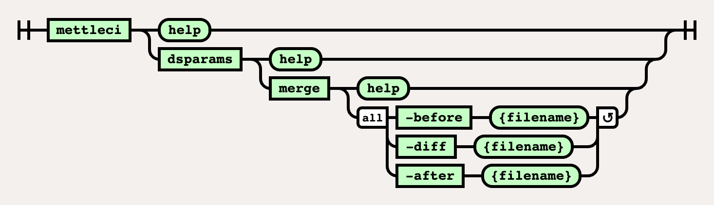

# DSParams Merge Command

# Purpose

Creates a new DSParams file from an existing DSParams file and merging
it with the provided diff file.

# Syntax



# Example

``` bash
$> mettleci dsparams merge \
   -before .\DSParams \
   -diff .\DSParams_diff \
   -after .\DSParams_new 
   
MettleCI Command Line (build ${buildNumber})
(C) 2018-2020 Data Migrators Pty Ltd
Merging differences from .\DSParams_diff (-diff) into .\DSParams (-before), to create .\DSParams_new (-after)
Comparing section PROJECT...
Section present in -before. Adding entries...
JobAdminEnabled=0
…
Differences added
Comparing section EnvVarValues...
Section not present in -before. Adding entire section.
Merge complete. Writing merged DSParams to .\DSParams_new (-after)
```

  

## Attachments:


[image-20220816-095731.png](attachments/458556064/2280882184.png)
(image/png)  
