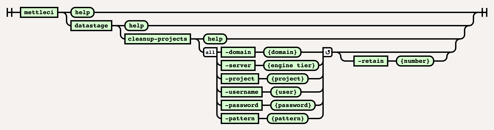

# DataStage Cleanup-Projects Command

# Purpose

Deletes redundant DataStage projects matching a supplied pattern.

## Syntax



# Example

``` bash
$> mettleci datastage cleanup-projects \
   -domain my-services.datamigrators.io:59445 \
   -username isadmin \
   -password isadminpwd \
   -server my-engine.datamigrators.io \
   -pattern Test[0-9] \
   -retain 1
Listing projects:
  - ANALYZERPROJECT
  - DataClick
  - dstage1
  - Test1
    - matches pattern
  - Test2
    - matches pattern
  - Test4
    - matches pattern
  - SWPensionStrategy
  - wwi_prod
Cleaning up old projects, retaining 1 most recent projects
 * Delete 'test2-engn.datamigrators.io/Test4' - SKIPPED
Deleting project: SNTest2
 * Delete 'test2-engn.datamigrators.io/Test2' - COMPLETED
Deleting project: SNTest1
 * Delete 'test2-engn.datamigrators.io/Test1' - COMPLETED
```

  

## Attachments:


[image2019-10-3_14-10-44.png](attachments/458424418/458424421.png)
(image/png)  

[image2019-10-3_14-8-55.png](attachments/458424418/458424424.png)
(image/png)  

[image2019-10-3_14-6-14.png](attachments/458424418/458424427.png)
(image/png)  

[image-20220617-104001.png](attachments/458424418/2232647762.png)
(image/png)  

[image-20220617-104041.png](attachments/458424418/2233040967.png)
(image/png)  
