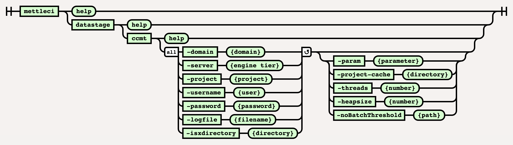

# DataStage Connector Migration Command

# Purpose

This command performs a connector migration using <a
href="https://www.ibm.com/docs/en/iis/11.7?topic=connectivity-connector-migration-tool"
rel="nofollow">IBM’s Connector Migration Tool</a> ('CCMT'). It
specifically provides the following capabilities….

-   Invoke the DataStage Connector Migration Tool using optional
    supplied parameters.

-   Logs all behaviour to a specified log file.

-   Runs using parallelism (using the `-threads` option) for optimum
    performance

-   Once complete, it runs a DataStage compilation command
    (`mettleci datastage compile`,
    <a href="DataStage_Compile_Command" data-linked-resource-id="410157081"
    data-linked-resource-version="33"
    data-linked-resource-type="page">described here</a>) and produces a
    <a href="JUnit_Test_Results" data-linked-resource-id="1754890299"
    data-linked-resource-version="7"
    data-linked-resource-type="page">JUnit-compatible</a> test result.

# Syntax



# Example

``` bash
$> mettleci datastage ccmt ^
   -domain my_service_tier.datamigrators.io:59445 ^
   -username isadmin ^
   -password my_password ^
   -server my_engine_tier.datamigrators.io ^
   -project my_project ^
   -param "-J ConnectorTest" ^
   -logfile \log\ccmt\log\cc_migrate.log.txt ^
   -isxdirectory /path/to/isx ^
   -threads 4 ^
   -param " -M "
   -param " -T "
   -param " -V OracleConnector=12,OracleConnectorPX=12 "
MettleCI Command Line (build 128)
(C) 2018-2022 Data Migrators Pty Ltd
Generating dump report on... my_project
Project my_project dump report generated (22.871 seconds)
Executing CCMT on... my_project
Project my_project CCMigrated successfully (32.634 seconds)
The following jobs Connector Migrated:
   CCMT_Test migrated successfully
Executing CCMT on... my_project
Project ccmt_test CCMigrated successfully (15.220 seconds)
Variant for stage type OracleConnectorPX was changed in 2 stage instances
Variant for stage type OracleConnector was changed in 0 stage instances
Variant for stage type updated complete
Compiling DataStage jobs...
 * Compile 'my_engine_tier.datamigrators.io/my_project/Jobs/CCMT_Test.pjb' - COMPLETED
Compilation complete
Creating JUnit test suite
JUnit test suite created successfully
```

  

## Attachments:


[image-20220617-103146.png](attachments/410681364/2232647756.png)
(image/png)  
