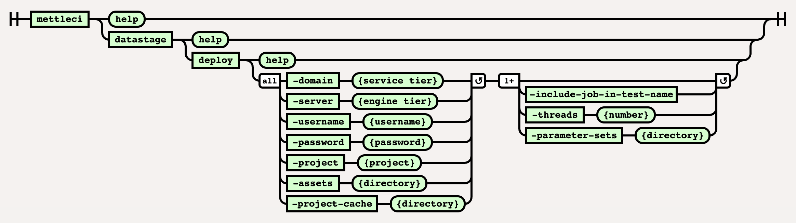

# DataStage Deploy Command

# Purpose

This command deploys a specified directory containing one or more
DataStage ISX files to a specified target DataStage environment
(project). 

-   the `datastage deploy` command performs incremental deployment.

-   the `-assets` parameter specifies the deployment source directory
    containing ISX files.

-   the `-project` value is the name of the DataStage target project.

-   the `-project-cache` parameter specifies a shared directory
    containing state information for this DataStage target project.
    These are the DataStage asset fingerprints which are used to
    identify changes in your DataStage code. See our <a
    href="https://datamigrators.atlassian.net/wiki/spaces/MCIDOC/pages/1356890161/MettleCI+CLI+and+the+project-cache+directory"
    rel="nofollow">more detailed explanation</a>.

-   the `-threads` parameter specifies how many concurrent compilation
    operations will be performed.

-   DataStage compilation results are converted to test results in JUnit
    format.

See <a
href="https://datamigrators.atlassian.net/wiki/spaces/MCIDOC/pages/1266843717/Repeatable+DataStage+Project+Deployments"
data-linked-resource-id="1266843717" data-linked-resource-version="8"
data-linked-resource-type="page">Repeatable DataStage Project
Deployments</a> for more details on how the `-project-cache` parameter
is used to implement **incremental deployment**.

# Syntax



# Example

``` bash
c:\> mettleci datastage deploy
     -domain demo115-svcs.dm-demo-datastage.datamigrators.io:59445
     -server demo115-engn.dm-demo-datastage.datamigrators.io
     -project wwi_jenkins_ds_115_ci
     -username isadmin
     -password ****
     -assets datastage
     -parameter-sets "config\Parameter Sets"
     -threads 1
     -project-cache "C:\MettleCI\cache\demo115-engn.dm-demo-datastage.datamigrators.io\wwi_jenkins_ds_115_ci" 

MettleCI Command Line (build 128)
(C) 2018-2022 Data Migrators Pty Ltd
Analyzing demo115-engn.dm-demo-datastage.datamigrators.io/wwi_jenkins_ds_115_ci
Attempting to identify changes with 1 working threads.
Inspecting DataStage assets for changes...
 * Check demo115-engn.dm-demo-datastage.datamigrators.io/wwi_jenkins_ds_115_ci/Jobs/Extract/EX_CITY.pjb - COMPLETED
 * Check demo115-engn.dm-demo-datastage.datamigrators.io/wwi_jenkins_ds_115_ci/Jobs/Extract/EX_SALE.pjb - COMPLETED
 * Check demo115-engn.dm-demo-datastage.datamigrators.io/wwi_jenkins_ds_115_ci/Jobs/Load/LD_STOCK_HOLDING.pjb - COMPLETED
<SNIP>
 * Check demo115-engn.dm-demo-datastage.datamigrators.io/wwi_jenkins_ds_115_ci/Jobs/ParameterSets/pGlobal.pst - COMPLETED
 * Check demo115-engn.dm-demo-datastage.datamigrators.io/wwi_jenkins_ds_115_ci/Jobs/Connections/DMSqlServer_DW.dcn - COMPLETED
 * Check demo115-engn.dm-demo-datastage.datamigrators.io/wwi_jenkins_ds_115_ci/Jobs/Connections/DMSqlServer_OLTP.dcn - COMPLETED
Change identification complete
Optimising assets for import
 * Update 'Jobs/ParameterSets/pDMSqlServer_DW.pst' - COMPLETED
 * Update 'Jobs/ParameterSets/pDMSqlServer_OLTP.pst' - COMPLETED
 * Update 'Jobs/ParameterSets/pGlobal.pst' - COMPLETED
 * Update 'Jobs/ParameterSets/pDMSqlServer_OLTP.pst' - COMPLETED
Attempting to import with 1 working threads.
Importing DataStage assets...
 * Import 'demo115-engn.dm-demo-datastage.datamigrators.io/wwi_jenkins_ds_115_ci/Jobs/ParameterSets/pDMSqlServer_DW.pst' - COMPLETED
 * Import 'demo115-engn.dm-demo-datastage.datamigrators.io/wwi_jenkins_ds_115_ci/Jobs/ParameterSets/pDMSqlServer_OLTP.pst' - COMPLETED
 * Import 'demo115-engn.dm-demo-datastage.datamigrators.io/wwi_jenkins_ds_115_ci/Jobs/ParameterSets/pGlobal.pst' - COMPLETED
 * Import 'demo115-engn.dm-demo-datastage.datamigrators.io/wwi_jenkins_ds_115_ci/Jobs/ParameterSets/pDMSqlServer_OLTP.pst' - COMPLETED
Import complete
```

  

## Attachments:


[image-20220617-101622.png](attachments/423952410/2232647732.png)
(image/png)  

[image-20220617-104408.png](attachments/423952410/2233663530.png)
(image/png)  
