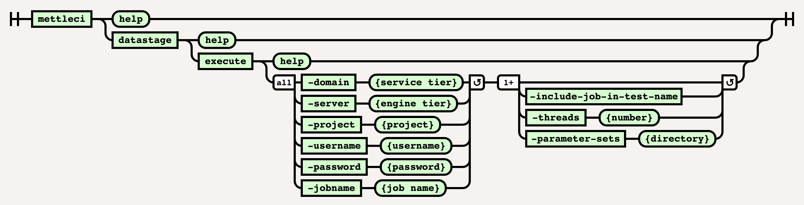

# DataStage Execute Command

# Purpose

Execute a DataStage job.

# Syntax



# Example

``` bash
$> mettelci datastage execute \
   -domain test1-svcs.datamigrators.io:59445 \
   -server test1-engn.datamigrators.io \
   -username isadmin -password password1 \
   -project dstage1 \
   -jobname TR_ORDERS \
   -runmode NORMAL
```

  

## Attachments:


[image-20220617-104917.png](attachments/458817755/2233041004.png)
(image/png)  
