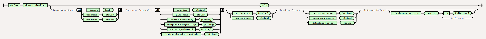

# Deploy DevOps-Pipeline Command



# Purpose

The following MettleCI Command Line Interface syntax can be used to
generate the Bamboo based CI/CD pipeline:

``` java
$> mettleci deploy devops-pipeline help
The following options are required: -datastage-install -plan-name -username -source-repository -plan-key
 -bamboo-shared-credentials -bamboo -password
Usage: devops-pipeline [options]
  Options:
  * -bamboo
       URL for Bamboo server
  * -username
       Bamboo username
  * -password
       Bamboo password
  * -plan-key
       Bamboo Plan key
  * -plan-name
       Bamboo Plan name
  * -source-repository
       Bamboo Linked Repository containing Project Source code
  * -datastage-install
       DataStage capability used by plan
  * -bamboo-shared-credentials
       Name of Bamboo shared credentials used when connecting to DataStage
    -project-key
       Bamboo Project key
       Default: MCI
    -project-name
       Bamboo Project name
       Default: MettleCI
    -datastage-domain
       DataStage domain
       Default: <empty string>
    -datastage-server
       DataStage server
       Default: <empty string>
    -datastage-project
       DataStage project
       Default: <empty string>
    -compliance-repository
       Bamboo Linked Repository containing Compliance Rules
       Default: Compliance Rules
    -deployment-name
       Bamboo Deployment name
    -E
       Environment names using <ID>=<Name> syntax
       Syntax: -Ekey=value
       Default: {}
```

Here’s an example:

``` java
$> mettleci deploy rdu-pipeline 
   -bamboo http://bamboohost.myorg:8085 -username bambooadmin -password bambooadmin123 
   -legacy-shared-credentials "DataStage 9.1 Dev/Test" -upgrade-shared-credentials “DataStage 11.7 <ENVIRONMENT_ID>” 
   -compliance-repository "Compliance Rules" 
   -source-repository "MyRepo" -migrate-connectors -project-key "MYPROJ" -datastage-project "CVI_LOGILITY83" 
   -legacy-datastage-install "DataStage 9.1" -upgrade-datastage-install "DataStage 11.7" 
   -legacy-datastage-domain "services.myorg.com:9443" -upgrade-datastage-domain "dstgappldv02:9446" 
   -legacy-datastage-server “engine.myorg.com"  
   -mettleci-home “E:\MettleCI\dm\mci” -upgrade-datastage-server "DSTGDBMSDV02.CORP.COOPERVISION.COM" 
   -E "sit=System Integration Test”
```

## Attachments:


[devops-template.zip](attachments/549225052/549225058.zip)
(application/octet-stream)  

[image-20200211-061415.png](attachments/549225052/549225061.png)
(image/png)  

[image-20200211-060855.png](attachments/549225052/549225064.png)
(image/png)  

[image-20200211-060531.png](attachments/549225052/549225067.png)
(image/png)  

[image-20200211-060427.png](attachments/549225052/549225070.png)
(image/png)  
 [Example
Pipeline.png](attachments/549225052/549225073.png) (image/png)  
 [Example
Pipeline](attachments/549225052/549225076) (application/gliffy+json)  

[image-20200211-045644.png](attachments/549225052/549225079.png)
(image/png)  

[image-20200211-030431.png](attachments/549225052/560431112.png)
(image/png)  

[image-20200211-005129.png](attachments/549225052/549225085.png)
(image/png)  

[image-20200210-065144.png](attachments/549225052/549225088.png)
(image/png)  

[image-20200211-030431.png](attachments/549225052/549225082.png)
(image/png)  
