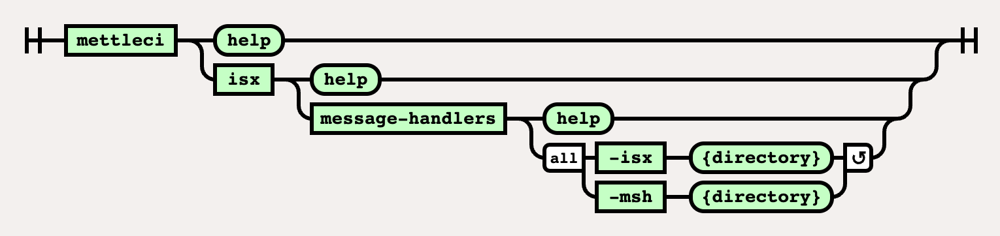

# ISX Message-Handlers Command

# Purpose

Inject Job-level Message Handlers into ISX files that then will be
imported into DataStage.

# Syntax



# Example

``` java
$> mettleci isx message-handlers \
   -isx isx_dir \
   -msh msh_handler_dir
```

  

------------------------------------------------------------------------

## See also

<a href="DataStage_Message_Handlers_Bamboo_Task"
data-linked-resource-id="412155905" data-linked-resource-version="3"
data-linked-resource-type="page">DataStage Message Handlers Bamboo
Task</a>

## Attachments:


[datastage-cleanup.svg](attachments/412286979/454984135.svg)
(image/svg+xml)  

[image2019-10-3_15-7-26.png](attachments/412286979/454918438.png)
(image/png)  

[image-20220816-095956.png](attachments/412286979/2280685646.png)
(image/png)  
