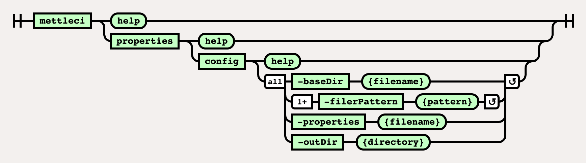

# Properties Config Command

# Purpose

Replaces variables in specified files using a properties file. It will
use any environment variables on the system and variables defined in a
properties file.

This command is invoked by your build system agent and executes under
the user account you configured for that agent in your build system. The
command itself does not require any credentials as it runs natively on
your <a
href="https://datamigrators.atlassian.net/wiki/spaces/MCIDOC/pages/1770520622/A+Summary+of+MettleCI+Components#MettleCI-Agent-Host"
rel="nofollow">MettleCI Agent Host</a>.

# Syntax



## Example

``` bash
$> mettleci properties config 
   -baseDir datastage                   # Only consider files under 'datastage' folder in git
   -filePattern "DSParams"                # Substitute values in the 'DSParams' file
   –filePattern "Parameter Sets/*/*"   # ... and in the Parameter Set value files
   -properties var.uat                  # Use a Variables Properties file specific to (in this example) the UAT environment
   -outDir config                       # Output updated files to separate directory
```

The properties file is in a key/value pair format, e.g:

``` java
mettleci.prop1=value1
mettleci.prop2=value2
prop3=value3
```

Variables in files to be replaced need to be defined in the format
`${VARIABLE_KEY}`, e.g:

``` bash
export MY_FIRST_PROPERTY=${mettleci.prop1}
export MY_SECOND_PROPERTY=${mettleci.prop2}
cat FILE | grep ${prop3}
```

  

## Attachments:


[image-20220816-235800.png](attachments/718962693/2281766913.png)
(image/png)  
