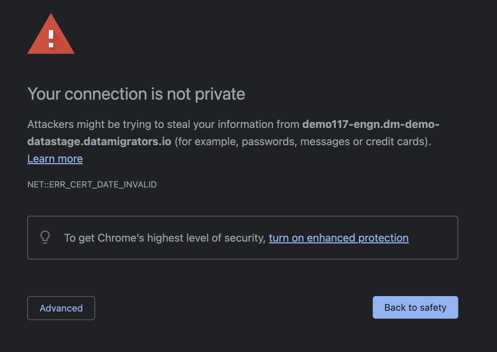
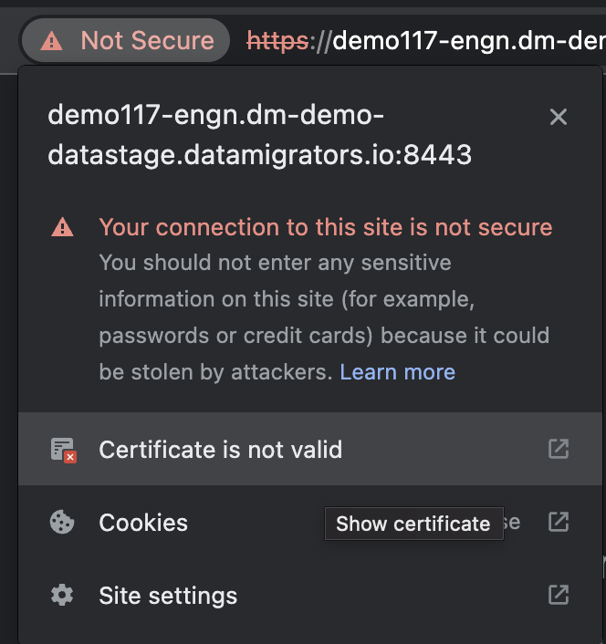
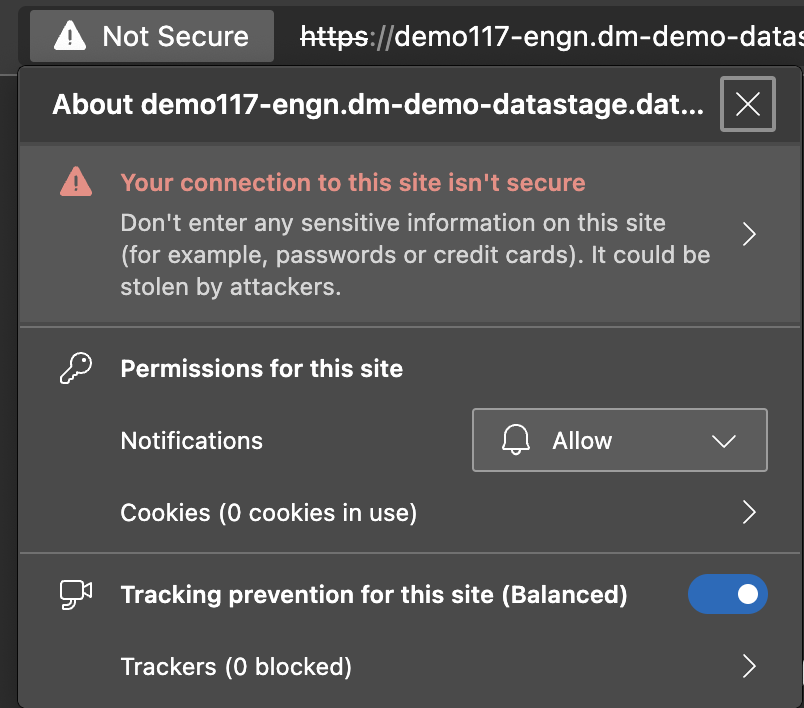
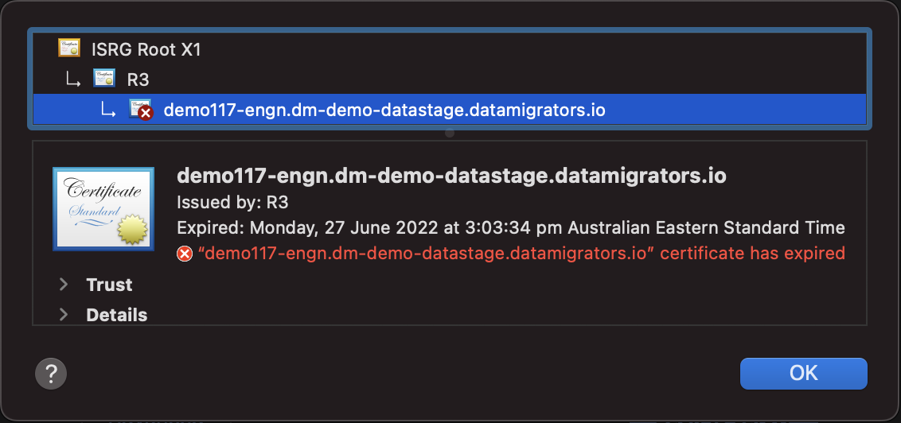

# ✏️Trusting a SSL Certificate on macOS

If the Workbench SSL certificate is not trusted you will see a prompt
alerting you about this.

Click the Not Secure text in the address bar and select the
**Certificate is not valid** (or similar) warning.

Note that the wording and format of this warning varies by browser.

 Drag and Drop the certificate icon and place the certificate on your
desktop.

You should see a new icon on your desktop after you release your mouse.

 

Double Click the certificate on your desktop to add the certificate to
the System keychain. You will need to authenticate this action with an
administrator credential.

 If Keychain Access does not automatically open, open the Application
Keychain Access.

Once it is open, navigate to the new certificate by selecting
Certificates on the left side menu, then finding the certificate in the
list.

Once you have found the certificate, double click the certificate to
load the details.

 Expand the Trust section of the certificate and find the option:

"When using this certificate"

 

Mark this as "Always Trust".

 

Close the certificate details window.

 

Upon closing the Window, you will need to verify and provide
Administrator credentials to confirm your change to trust the
certificate.

## Attachments:

[image-20220802-064440.png](attachments/2269511701/2269249544.png)
(image/png)  

[image-20220802-064544.png](attachments/2269511701/2269282317.png)
(image/png)  

[image-20220802-064747.png](attachments/2269511701/2269610003.png)
(image/png)  

[image-20220802-065506.png](attachments/2269511701/2269937683.png)
(image/png)  

[image-20220802-065512.png](attachments/2269511701/2269511711.png)
(image/png)  
