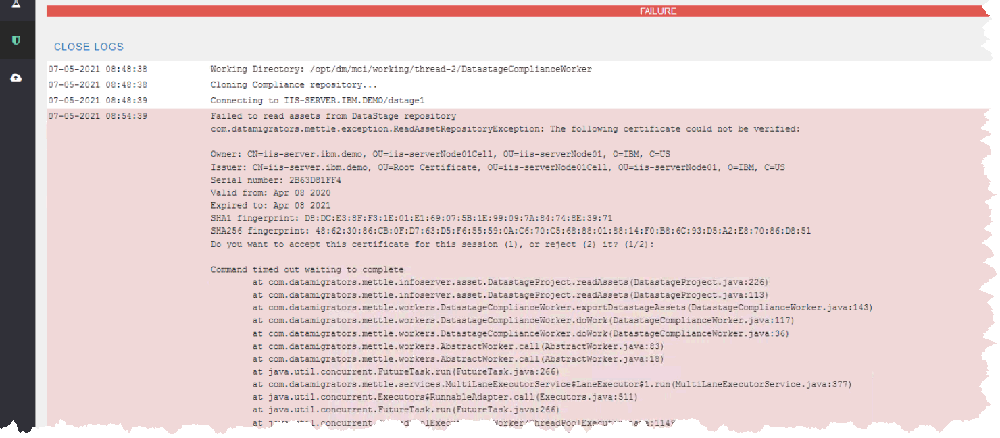

# Workbench exception "The following certificate could not be verified"

# Problem

Attempting to run Compliance produces an error of the form “Failed to
read assets from DataStage repository” and “The following certificate
could not be verified.” This exception may also be encountered when
invoking other MettleCI functions that involve the retrieval of assets
from DataStage.

# Reason

The DataStage Services Tier self-signed certificate that usually resides
in the trusted store of the MettleCI Workbench host is missing or has
expired. The example screenshot shows the second situation and the error
text between `...ReadAssetRepositoryException:` and
`Command timed out ...` comes straight from the DataStage CLI command
that Workbench is attempting to run in the background during its
operations. Since this is effectively an API call by Workbench, users
cannot respond to that prompt from within the Workbench UI.

# Solution

Users will need to do one of the following on the machine hosting that
MettleCI Workbench instance:

1.  Run the UpdateSignerCerts command per <a
    href="https://www.ibm.com/docs/en/iis/11.7?topic=certificates-running-updatesignercerts-command"
    rel="nofollow">IBM’s instructions</a>; or

2.  Run an `istool export` operation from
    `<IS_install_path>/Clients/istools/cli`

…to trigger that certificate acceptance prompt and permanently accept
the up-to-date certificate.

Once accepted, you shouldn’t have to do it again until the cert expires
or some other non-MettleCI event invalidates it.

## Attachments:

[image-20210510-144656.png](attachments/1692336250/1692369017.png)
(image/png)  
