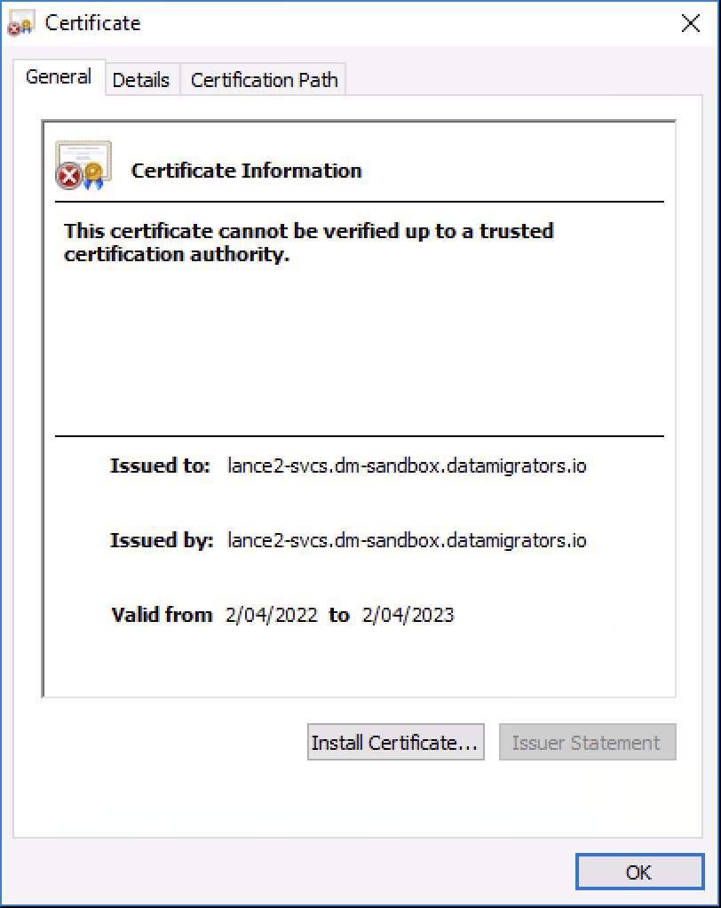
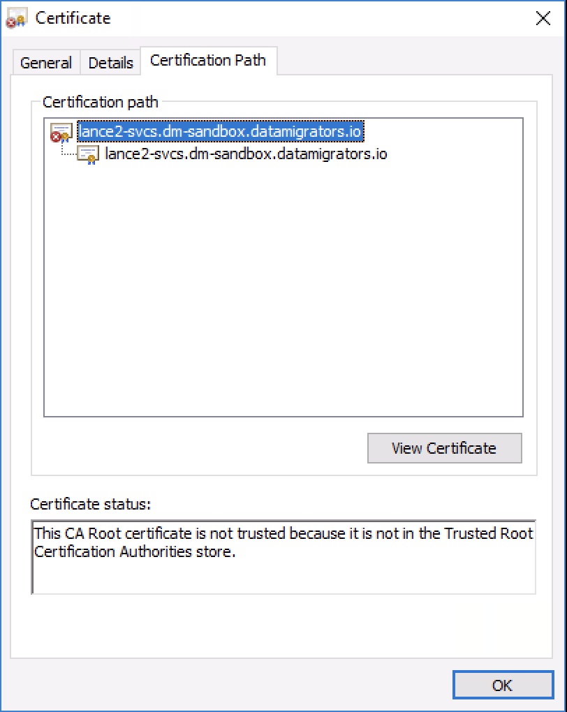

# ✏️The Certificate Issuer for this site is untrusted 🔒

<a
href="https://www.ibm.com/docs/en/iis/11.7?topic=certificates-running-updatesignercerts-command"
rel="nofollow">Running the UpdateSignerCerts command - IBM
Documentation</a>

???

## Attachments:

[image-20220413-024542.png](attachments/2185003018/2185035796.png)
(image/png)  

[image-20220413-024759.png](attachments/2185003018/2185232397.png)
(image/png)  

[image-20220413-024855.png](attachments/2185003018/2185363466.png)
(image/png)  
