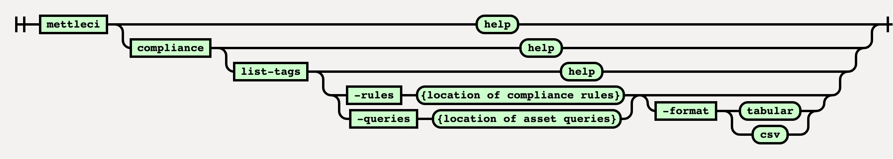
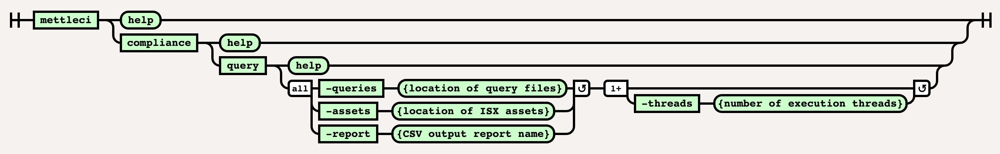

# Compliance namespace

## Compliance List Tags



This command analyses a specified set of Compliance Rules or Asset Queries and reports the tags defined for each.  Output is available in an easy-to-read tabulated for, or as a CSV for downstream processing. When no format optin

### Example

This example shows how to list the tags of a directory of Compliance Rules in both tabulated and CSV formats:
      
```shell
# ####################################
# list-tags output in tabulated format
# ####################################
$> mettleci compliance list-tags -rules ~/Projects/bitbucket.org/compliance-rules -format table
MettleCI Command Line (build 174)
(C) 2018-2022 Data Migrators Pty Ltd
compliance list-tags (v2.2.x)
rules configuration discovered
included rule - 'Adjacent Transformers' (PARALLEL_JOB)
included rule - 'Adjacent Transformers' (SERVER_JOB)
... <SNIP> ...
included rule - 'Transformer With Unreferenced Stage Variable' (SERVER_JOB)
included rule - 'Unique Sort' (PARALLEL_JOB)
                                       Rule Name  Asset Type                 example  fail-ci  fail-upgrade  functionality  governance  maintainability  performance  portability  security  testability
================================================  =========================  =======  =======  ============  =============  ==========  ===============  ===========  ===========  ========  ===========
                           Adjacent Transformers  PARALLEL_JOB               -------  -------  ------------  -------------  ----------  maintainability  -----------  -----------  --------  -----------
                           Adjacent Transformers  SERVER_JOB                 -------  -------  ------------  -------------  ----------  maintainability  -----------  -----------  --------  -----------
                                Audit Annotation  PARALLEL_JOB               example  -------  ------------  -------------  ----------  maintainability  -----------  -----------  security  -----------
                                Audit Annotation  SEQUENCE_JOB               example  -------  ------------  -------------  ----------  maintainability  -----------  -----------  security  -----------
                                Audit Annotation  SERVER_JOB                 example  -------  ------------  -------------  ----------  maintainability  -----------  -----------  security  -----------
                                          <SNIP>  <SNIP>                     ...      ...      ...           ...            ...         ...              ...          ...          ...       ...
               Transformer Uses Abort After Rows  PARALLEL_JOB               -------  -------  ------------  functionality  ----------  ---------------  -----------  -----------  --------  -----------
               Transformer Uses Abort After Rows  PARALLEL_SHARED_CONTAINER  -------  -------  ------------  functionality  ----------  ---------------  -----------  -----------  --------  -----------
    Transformer With Unreferenced Stage Variable  PARALLEL_JOB               -------  -------  ------------  functionality  ----------  maintainability  -----------  -----------  --------  -----------
    Transformer With Unreferenced Stage Variable  SERVER_JOB                 -------  -------  ------------  functionality  ----------  maintainability  -----------  -----------  --------  -----------
                                     Unique Sort  PARALLEL_JOB               -------  -------  ------------  -------------  ----------  maintainability  -----------  -----------  --------  -----------
# ##############################
# list-tags output in CSV format
# ##############################
$> mettleci compliance list-tags -rules ~/Projects/bitbucket.org/compliance-rules -format csv
MettleCI Command Line (build 174)
(C) 2018-2022 Data Migrators Pty Ltd
compliance list-tags (v2.2-SNAPSHOT)
rules configuration discovered
... <SNIP> ...
Rule Name,Asset Type,example,fail-ci,fail-upgrade,functionality,governance,maintainability,performance,portability,security,testability
Adjacent Transformers,PARALLEL_JOB,,,,,,maintainability,,,,
Adjacent Transformers,SERVER_JOB,,,,,,maintainability,,,,
Audit Annotation,PARALLEL_JOB,example,,,,,maintainability,,,security,
Audit Annotation,SEQUENCE_JOB,example,,,,,maintainability,,,security,
Audit Annotation,SERVER_JOB,example,,,,,maintainability,,,security,
... <SNIP> ...
Transformer With Unreferenced Stage Variable,PARALLEL_JOB,,,,functionality,,maintainability,,,,
Transformer With Unreferenced Stage Variable,SERVER_JOB,,,,functionality,,maintainability,,,,
Unique Sort,PARALLEL_JOB,,,,,,maintainability,,,,
$>
```
 
## Compliance Query Command
 
???+ info "This command is for running MettleCI Asset Queries"

    If you're looking for the **Compliance Rules** returned by DataStage flow analysis then see the [Compliance Test](#compliance-test-command) Command.



The command line implementation of the Compliance Query functionality exposes the low-level mechanism to produce a report listing the results of the specified Asset Queries.

### Example

This example demonstrates how to export  a set of ISX files and run Asset Queries against them. Note that asset paths specification in the export command uses the same wildcard rules as the istool command.

```shell
# ============================== 
# Export the required ISX assets
# ============================== 
C:\> mettleci isx export ^
     -domain myteam-svcs.corp.com:59445 ^
     -username myuser -password mypassword ^
     -server myteam-engn.corp.com ^
     -project myproject ^
     -jobname .*LD_S.*
Exporting [.*LD_S.*] from repository...
Exporting DataStage assets...
 * Export 'test2-engn.datamigrators.io/myproject/Jobs/Load/LD_SUPPLIER.pjb' - COMPLETED
 * Export 'test2-engn.datamigrators.io/myproject/Jobs/Load/LD_STOCK_HOLDING.pjb' - COMPLETED
 * Export 'test2-engn.datamigrators.io/myproject/Jobs/Load/LD_STOCKITEM.pjb' - COMPLETED
 * Export 'test2-engn.datamigrators.io/myproject/Jobs/Load/LD_SALE.pjb' - COMPLETED
Export complete
# ================================================================
# Run the specified asset queries against the exported ISX assets
# ================================================================
C:\> mettleci compliance query \
     -assets ./Jobs \
     -queries ./Queries \
     -report compliance.csv \
MettleCI Command Line (build 122)
(C) 2018-2020 Data Migrators Pty Ltd
 <SNIP>
# Done!
C:\>
```

## Compliance Test Command

???+ info "This command is for running MettleCI Compliance Rules"

    If you're looking for the **Asset Queries** typically used in a MettleCI Report Card then please see the [Compliance Query](#compliance-query-command) Command.


The command line implementation of the Compliance Test functionality enables the production of a Compliance Results report of the specified assets against the specified set of MettleCI Compliance Rules.

For more information on using the `-project-cache` parameter see our [detailed explanation]().

### Example

This example demonstrates how to export  a set of ISX files and run Compliance against them. Note that asset paths specification in the export command uses the same wildcard rules as the istool command.

```shell
# ============================== 
# Export the required ISX assets
# ============================== 
C:\MettleCI\cli\> mettleci isx export ^
     -domain myteam-svcs.corp.com:59445 ^
     -username myuser -password mypassword  ^
     -server myteam-engn.corp.com  ^
     -project myproject  ^
     -location C:\shared\myproject\export  ^
     -include-binaries  ^
     -project-cache C:\shared\myproject\cache
Analyzing test2-engn.datamigrators.io/myproject
Attempting to identify changes with 4 working threads.
Inspecting DataStage assets for changes...
<SNIP>
Change identification complete
Inspecting ParameterSet definition changes...
ParameterSet definition change identification complete
Deleting assets...
<SNIP>
Deletion complete
Exporting DataStage assets...
<SNIP>
Export complete
Attempting to identify last change with 4 working threads.
Inspecting DataStage assets for last change...
<SNIP>
Last change identification complete
# ==================================================================
# Run the specified compliance rules against the exported ISX assets
# ==================================================================
$> mettleci compliance test
  -rules compliance_rules
  -assets datastage
  -report compliance_report_warn.xml
  -junit
  -project-cache ./project-cache
  -test-suite warnings
  -ignore-test-failures
  -include-job-in-test-name
MettleCI Command Line (build 122)
(C) 2018-2020 Data Migrators Pty Ltd
rules configuration discovered
new rule discovered - 'Adjacent Transformers' (PARALLEL_JOB)
new rule discovered - 'CCMigrateTool Stages' (PARALLEL_JOB)
new rule discovered - 'CCMigrateTool Stages' (SERVER_JOB)
new rule discovered - 'Database Row Limit' (PARALLEL_JOB)
new rule discovered - 'Database Row Limit' (SERVER_JOB)
new rule discovered - 'Debug Row Limit' (PARALLEL_JOB)
<SNIP>
new rule discovered - 'One Dataflow' (SERVER_JOB)
new rule discovered - 'Range Lookup' (PARALLEL_JOB)
new rule discovered - 'Too Many Stages' (PARALLEL_JOB)
new rule discovered - 'Too Many Stages' (SERVER_JOB)
new rule discovered - 'Unique Sort' (PARALLEL_JOB)
[1/3] TestJob_0921 (PARALLEL_JOB)
[2/3] TestJob_0930 (PARALLEL_JOB)
[3/3] TestJob (PARALLEL_JOB)
# Done!
$>
```

## References

For a discussion on the use of the `include-tags` and `exclude-tags` options see [Compliance Rule Tags]().