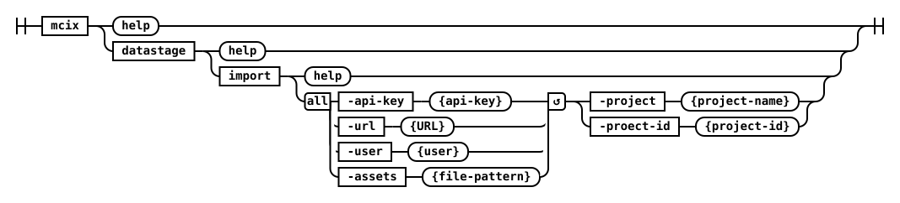

# datastage namespace

The datastage namespace contains commands for working with IBM Cloud Pak for Data (CP4D) DataStage assets.

## datastage compile


Compiles a DataStage Job producing a JUnit-compatible testing output that can be utilised by built tools orchestrating a CI/CD pipeline.  This command produces a [JUnit-compatible](https://junit.org/) XML file called `mettleci_compilation.xml` which reports each individual job’s compilation result.

#### Parameters

- **api-key** *(Required)*
    - CP4D/CP4DaaS API key
- **-url** *(Required)*
    - Base url of CP4D/CP4DaaS
- **-user** *(Required)*
    - CP4D/CP4DaaS username
- **-report** *(Required)*
    - JUnit compilation report file
- **-project** *(Required when `-project-id` not specified)*
    - Name of target project
- **-project-id** *(Required when `-project` not specified)*
    - Id of target project
- **-include-job-in-test-name** *(Default: false)*
    - Test case names will include the compiled asset name in the JUnit reports

#### Example

```shell
$> mcix datastage compile \
   -api-key XXXXXXXXXXXXXXXXXXXXXXXX \
   -url https://cp4d.datamigrators.io \
   -user isadmin \
   -report mettleci_compilation.xml \
   -project dstage1 \
   -include-asset-in-test-name

Analyzing assets to compile
Compilation folder location = C:\Apps\command-shell\log\compiliation
Attempting to compile with 4 working threads.
Compiling DataStage jobs...
 * Compile 'engine_tier.datamigrators.io/dstage1/Jobs/Load/LD_STOCKITEM.pjb' - COMPLETED
 * Compile 'engine_tier.datamigrators.io/dstage1/Jobs/Load/LD_SALE.pjb' - COMPLETED
 * Compile 'engine_tier.datamigrators.io/dstage1/Jobs/Load/LD_SUPPLIER.pjb' - COMPLETED
 * Compile 'engine_tier.datamigrators.io/dstage1/Jobs/Load/LD_STOCK_HOLDING.pjb' - COMPLETED
Compilation complete
``` 

---

## datastage import



Imports DataStage assets from a DataStage export zip file or directory into a CP4D/CP4DaaS project.  This command produces a [JUnit-compatible](https://junit.org/) XML file called `mettleci_import.xml` which reports each individual asset’s import result.

#### Parameters

- **api-key** *(Required)*
    - CP4D/CP4DaaS API key
- **-url** *(Required)*
    - Base url of CP4D/CP4DaaS
- **-user** *(Required)*
    - CP4D/CP4DaaS username   
- **-assets** *(Required)*
    - Path to DataStage export zip file or directory
- **-project** *(Required when `-project-id` not specified)*
    - Name of target project
- **-project-id** *(Required when `-project` not specified)*
    - Id of target project

#### Example

```shell
$> mcix datastage import \
   -api-key XXXXXXXXXXXXXXXXXXXXXXXX \
   -url https://cp4d.datamigrators.io \
   -user isadmin \
   -assets C:\Apps\command-shell\examples\datastage\export\dstage1.zip \
   -project dstage1 \
   -include-job-in-test-name

Importing DataStage assets
Import folder location = C:\Apps\command-shell\log\import
Importing DataStage assets from C:\Apps\command-shell\examples\datastage\export\dstage1.zip
 * Import 'engine_tier.datamigrators.io/dstage1/Jobs/Load/LD_STOCKITEM.pjb' - COMPLETED
 * Import 'engine_tier.datamigrators.io/dstage1/Jobs/Load/LD_SALE.pjb' - COMPLETED
 * Import 'engine_tier.datamigrators.io/dstage1/Jobs/Load/LD_SUPPLIER.pjb' - COMPLETED
 * Import 'engine_tier.datamigrators.io/dstage1/Jobs/Load/LD_STOCK_HOLDING.pjb' - COMPLETED
Import complete
```


