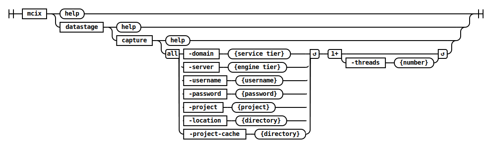
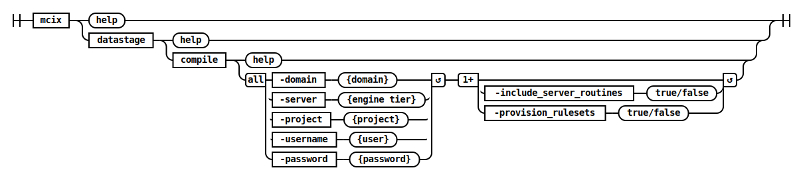
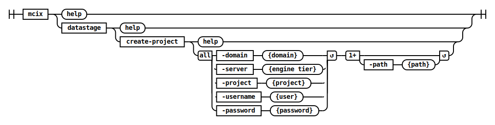

# DataStage namespace

## DataStage Capture Command



This command captures the current state of a DataStage project by exporting its content to ISX files and updating the project cache.  The resulting ISX files and project cache can be used by the DataStage Deploy command to incrementally deploy changes that have occurred after DataStage Capture was performed.

* the `-location` parameter specifies the root directory of ISX files exported from the project.
* the `-project` value is the name of the DataStage target project.
* the `-project-cache` parameter specifies a shared directory containing state information for this DataStage target project.  These are the DataStage asset fingerprints which are used to identify changes in your DataStage code.  See a [detailed explanation](project-cache-directory.md).
* the `-threads` parameter specifies how many concurrent compilation operations will be performed.

### Example

Capture the current state of the project. 

```bat
c:\> mcix datastage capture ^
     -domain datastage-services.myorganization.com:59445 ^
     -server datastage-engine.myorganization.com ^
     -project myproject ^
     -username isadmin ^
     -password **** ^
     -location datastage ^
     -threads 4 ^
     -project-cache "C:\MettleCI\cache\datastage-engine.myorganization.com\myproject" 
MettleCI Command Line (build 128)
(C) 2018-2022 Data Migrators Pty Ltd
Analyzing DATASTAGE-ENGINE.MYORGANIZATION.COM/myproject
Exporting DataStage assets...
 * Export 'DATASTAGE-ENGINE.MYORGANIZATION.COM/myproject/Jobs/Load/LD_SUPPLIER.pjb' - COMPLETED
 * Export 'DATASTAGE-ENGINE.MYORGANIZATION.COM/myproject/Jobs/Connections/DMSqlServer_OLTP.dcn' - COMPLETED
 * Export 'DATASTAGE-ENGINE.MYORGANIZATION.COM/myproject/Jobs/Utilities/UT_CONTROL.pjb' - COMPLETED
 * Export 'DATASTAGE-ENGINE.MYORGANIZATION.COM/myproject/Jobs/Load/LD_TRANSACTION.pjb' - COMPLETED
 * Export 'DATASTAGE-ENGINE.MYORGANIZATION.COM/myproject/Jobs/Extract/EX_PURCHASE.pjb' - COMPLETED
<snip>
 * Export 'DATASTAGE-ENGINE.MYORGANIZATION.COM/myproject/Jobs/Transform/TR_PURCHASE.pjb' - COMPLETED
 * Export 'DATASTAGE-ENGINE.MYORGANIZATION.COM/myproject/Jobs/Transform/TR_PAYMENT_METHOD.pjb' - COMPLETED
 * Export 'DATASTAGE-ENGINE.MYORGANIZATION.COM/myproject/Jobs/Extract/EX_SUPPLIER.pjb' - COMPLETED
 * Export 'DATASTAGE-ENGINE.MYORGANIZATION.COM/myproject/Jobs/Transform/TR_STOCK_HOLDING.pjb' - COMPLETED
 * Export 'DATASTAGE-ENGINE.MYORGANIZATION.COM/myproject/Jobs/Extract/EX_EMPLOYEE.pjb' - COMPLETED
Export complete
Attempting to identify last change with 4 working threads.
Inspecting DataStage assets for last change...
Last change to project occurred at 2023-12-21 04:37:37 GMT 
``` 

The DataStage Project has been captured as a set of ISX files and the project cache.  Deploying the captured state back into the source project will not cause any changes to be detected:

```bat
c:\> mcix datastage deploy ^
     -domain datastage-services.myorganization.com:59445 ^
     -server datastage-engine.myorganization.com ^
     -project myproject ^
     -username isadmin ^
     -password **** ^
     -assets datastage ^
     -threads 4 ^
     -project-cache "C:\MettleCI\cache\datastage-engine.myorganization.com\myproject" 
MettleCI Command Line (build 128)
(C) 2018-2022 Data Migrators Pty Ltd
Analyzing DATASTAGE-ENGINE.MYORGANIZATION.COM/myproject
Attempting to identify changes with 4 working threads.
Inspecting DataStage assets for changes...
Change identification complete, 0 asset changes detected in project
```

---

## DataStage Cleanup-Projects


Deletes redundant DataStage projects matching a supplied pattern.

### Example

```shell
$> mcix datastage cleanup-projects \
   -domain my-services.datamigrators.io:59445 \
   -username isadmin \
   -password isadminpwd \
   -server my-engine.datamigrators.io \
   -pattern Test[0-9] \
   -retain 1
Listing projects:
  - ANALYZERPROJECT
  - DataClick
  - dstage1
  - Test1
    - matches pattern
  - Test2
    - matches pattern
  - Test4
    - matches pattern
  - SWPensionStrategy
  - wwi_prod
Cleaning up old projects, retaining 1 most recent projects
 * Delete 'test2-engn.datamigrators.io/Test4' - SKIPPED
Deleting project: SNTest2
 * Delete 'test2-engn.datamigrators.io/Test2' - COMPLETED
Deleting project: SNTest1
 * Delete 'test2-engn.datamigrators.io/Test1' - COMPLETED
```

---

## DataStage Compile



Compiles a DataStage Job producing a jUnit-compatible testing output that can be utilised by built tools orchestrating a CI/CD pipeline.  This command produces a [JUnit-compatible](https://junit.org/) XML file called `mettleci_compilation.xml` which reports each individual job’s compilation result.

### Example

```shell
$> mcix datastage compile \
   -domain service_tier.datamigrators.io:59445 \
   -username isadmin \
   -password mypassword \
   -server engine_tier.datamigrators.io \
   -project dstage1 \
   -include-job-in-test-name
Analyzing assets to compile
Compilation folder location = C:\Apps\command-shell\log\compiliation
Attempting to compile with 4 working threads.
Compiling DataStage jobs...
 * Compile 'engine_tier.datamigrators.io/dstage1/Jobs/Load/LD_STOCKITEM.pjb' - COMPLETED
 * Compile 'engine_tier.datamigrators.io/dstage1/Jobs/Load/LD_SALE.pjb' - COMPLETED
 * Compile 'engine_tier.datamigrators.io/dstage1/Jobs/Load/LD_SUPPLIER.pjb' - COMPLETED
 * Compile 'engine_tier.datamigrators.io/dstage1/Jobs/Load/LD_STOCK_HOLDING.pjb' - COMPLETED
Compilation complete
``` 

---

## DataStage Create-Project



This command either creates a DataStage project in a nominated environment or simply exist with a success code if the DataStage project already exists. It is used frequently at the beginning of pipelines to assert that a target environment with which the pipeline will deploy and execute code is present and available.

### Example

```shell
$> mcix datastage create-project \
   -domain service_tier.datamigrators.io:59445 \
   -username isadmin -password mypassword \
   -server engine_tier.datamigrators.io \
   -project Test4
Test4 created successfully.
$>
```

### Usage Notes

Due to a known issue with the DataStage dsadmin command itself it is not possible to distinguish between…

* a DataStage project that already exists, and
* a DataStage project that doesn’t exist in the DataStage repository, but for which the associated filesystem directories does exist.

There may be some situations in which this causes the `mettleci datastage create-project` command to fail. When faced with an inexplicable failure of this nature check to see if the project’s directory structure already exists on the filesystem.  If so, and it’s safe to do so, remove the file structure and try again.


---

## DataStage Delete-Project


Deletes a DataStage project.

### Example

```shell
$> mcix datastage delete-project \
   -domain test2-svcs.datamigrators.io:59445 -server test2-engn.datamigrators.io \
   -username isadmin -password isadminpwd \
   -project Test3
```

---

## DataStage Deploy


This command deploys a specified directory containing one or more DataStage ISX files to a specified target DataStage environment (project). 

* the datastage deploy command performs incremental deployment.
* the `-assets` parameter specifies the deployment source directory containing ISX files.
* the `-project` value is the name of the DataStage target project.
* the `-project-cache` parameter specifies a shared directory containing state information for this DataStage target project.  These are the DataStage asset fingerprints which are used to identify changes in your DataStage code.  See our more detailed explanation.
* the `-threads` parameter specifies how many concurrent compilation operations will be performed.
* DataStage compilation results are converted to test results in JUnit format.

See Repeatable DataStage Project Deployments for more details on how the `-project-cache` parameter is used to implement incremental deployment.

### Example

```bat
c:\> mcix datastage deploy \
     -domain datastage-services.myorganization.com:59445 \
     -server datastage-engine.myorganization.com \
     -project wwi_jenkins_ds_115_ci \
     -username isadmin \
     -password **** \
     -assets datastage \
     -parameter-sets "config\Parameter Sets" \
     -threads 1 \
     -project-cache "C:\MettleCI\cache\datastage-engine.myorganization.com\jenkins_project" 
MettleCI Command Line (build 128)
(C) 2018-2022 Data Migrators Pty Ltd
Analyzing datastage-engine.myorganization.com/myproject
Attempting to identify changes with 4 working threads.
Inspecting DataStage assets for changes...
* Check datastage-engine.myorganization.com/myproject/Jobs/Transform/TR_CITY.pjb - CHANGED
Change identification complete, 1 asset changes detected in project
Deleting assets...
* Delete 'datastage-engine.myorganization.com/myproject/Jobs/Transform/TR_CITY.pjb' - COMPLETED
Deletion complete
Optimising assets for import
* Update 'Jobs/ParameterSets/pGlobal.pst' - COMPLETED
* Update 'Jobs/ParameterSets/pDMSqlServer_DW.pst' - COMPLETED
s* Update 'Jobs/ParameterSets/pDMSqlServer_OLTP.pst' - COMPLETED
Attempting to import with 1 working threads.
Importing DataStage assets...
* Import 'datastage-engine.myorganization.com/myproject/Jobs/ParameterSets/pDMSqlServer_OLTP.pst' - COMPLETED
* Import 'datastage-engine.myorganization.com/myproject/Jobs/ParameterSets/pDMSqlServer_DW.pst' - COMPLETED
* Import 'datastage-engine.myorganization.com/myproject/Jobs/ParameterSets/pGlobal.pst' - COMPLETED
* Import 'datastage-engine.myorganization.com/myproject/Jobs/Transform/TR_CITY.pjb' - COMPLETED
Import complete
Compiling DataStage jobs...
* Compile 'datastage-engine.myorganization.com/myproject/Jobs/Transform/TR_CITY.pjb' - COMPLETED
Compilation complete
sCreating JUnit test suite
JUnit test suite (mettleci_compilation.xml) created successfully
Attempting to identify last change with 4 working threads.
Inspecting DataStage assets for last change...
Last change to project occurred at 2023-12-17 22:07:00 GMT     
```

---

## DataStage Execute


Execute a DataStage job.

### Example

```shell
$> mcix datastage execute \
   -domain test1-svcs.datamigrators.io:59445 \
   -server test1-engn.datamigrators.io \
   -username isadmin -password password1 \
   -project dstage1 \
   -jobname TR_ORDERS \
   -runmode NORMAL
```