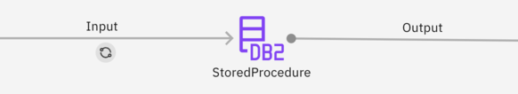

# Testing flows with stored procedure stages

A [connector stage which supports stored procedures](https://www.ibm.com/docs/en/cloud-paks/cp-data/5.1.x?topic=connectors-using-stored-procedures) will not only connect to an external Database for processing but it will also produce output records which are not deterministic.  A DataStage test case specification needs to treat stored procedure-capable stages which will be stubbed during unit test execution.  This is done by adding the relevant stage's input link to the `then` clause of the test specification and the output link to the `given` clause.

The CSV input specified by the given clause contains the data that will become the flow of records from the Stored Procedure stage. The data could simulate what would be produced by the real stored procedure if it had processed the Unit Test input records, however they don’t have to.

> [!NOTE]
> This process is handled automatically by the DataStage test case creation process. This page acts as a reference to explain the structure of the JSON test specification generated for flows including following this pattern.

## Flow design



## Test specification

```json
{
    "given": [
        {
            "path": "StoredProcedure-Output.csv",
            "stage": "StoredProcedure",
            "link": "Output" 
        }
    ],
    "then": [
        {
            "path": "StoredProcedure-Input.csv",
            "stage": "StoredProcedure",
            "link": "Input"
        }
    ],
    "when": {
        "parameters": { }
    }
}
```

## Result


