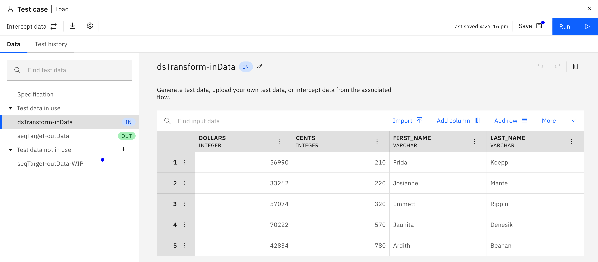

# Editing a DataStage test case

You can enter the DataStage® test cases editor either by selecting the Test case asset on the project page or from within the DataStage designer canvas.

- Open an existing project then open the **Assets** tab and under the **Asset types** panel select **DataStage components** > **Test cases** from where you can click the name of the test case you wish to edit.
- From the DataStage canvas open an existing DataStage flow then click the **Test cases** icon to open up the test cases side panel from where you can click the name of the test case you wish to edit.

This will bring you to the test case editor which allows you to inspect and modify your test case specification as well as edit the contents of your input and output test data files.

## Editing the test case specification

Selecting **Specification** from the **Data** tab will display the test case's specification.

For a detailed explanation of the format of this JSON specification and the options available for controlling how your test case behaves see [Test specification format](test-specification-format.md).

Each test data file referenced in your JSON specification (whether it represents input data or expected output data) will appear as a file under the **Test data in use** tree.  Selecting one of these will enable you to view and edit the test data.

## Editing test data

As well as using capture and import methods to derive test data, you can also manually enter test data into your test data files.  The test data table can be edited interactively like a spreadsheet and provides the following notable capabilities:

- Undo/redo of editing actions is supported with the traditional keyboard shortcuts Control-Z and Shift-Control-Z (Windows) or Command-Z and Shift-Command-Z (macOS).
- Values entered into a cell are validated based on the column's metadata definition. Invalid data is highlighted in red.

### Modifying metadata

- Rows can be added by selecting the **Add row** icon above the test data table.
- Rows can be deleted by selecting the three dots on the row header and clicking **Delete**.
- Columns can be added by selecting the **Add column** icon above the test data table.
- Columns can be deleted by selecting the three dots on the column header and clicking **Delete column**.

Modify the metadata of a test data column by selecting the three dots on the column header and clicking **Edit column**.  The resulting panel enables you to specify the column's name, data type, nullability, length, and extended metadata. Click **Save** to record your changes.

### Modifying test data outside the DataStage interface

You can export IBM Cloud Pak DataStage test data files to locally-stored CSV files for offline editing:

1. Click the menu overflow (**V**) button above the test data table to reveal more options and click **Download** .
1. Modify the local filename as required and click **Download**.  The resulting CSV file will be downloaded to your browser's default download location.

Once edited you can re-import your updated by clicking the **Import** button above the test data table and specifying your edited file before clicking **Import**.

## Managing test cases

### Rename a test case

You can rename a test case from the **asset browser** by moving your pointer over the test case name and clicking the edit icon which appears alongside it. Editing the name in the table cell and press the Return key or click the green checkmark to save your changes.

### Delete a test case

You can delete a test case from the **asset browser** by clicking the 'three dots' icon of the test case name and selecting **Delete**.  On the resulting dialog verify the relationships of the asset you're deleting and click **Delete** to confirm.

### Save changes

Once you're happy with your test data changes you can store your changes by clocking the **Save** button on the test data editor toolbar.

### Export a test case

Export a test case to a zip file by clicking the **Export** icon on the test case toolbar.  On the resulting dialog confirm the name of the export file and click **Download**.  Note that this export does not contain test data.  To export test data for external modification see **Modifying test data outside the DataStage interface** above.

## Test case settings

Click the **Settings** icon to open the test case settings panel which enables you to specify options for the selected test.

**History record storage** allows you to specify the number of historical test results you wish to retain. This can be specified either by the number of days or the number of runs.

**Schedule** allows you to specify a time and date when you want your test case job to be automatically executed and (optionally) the frequency with which the job should be re-executed.

Click **Save** to store your selections.
