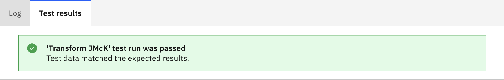

# Verifying test results

You can verify DataStage® test results either from the CPD Cluster home page, the DataStage designer canvas, or the DataStage test case editor.

## From the CPD Cluster home page

1. Open an existing project and select the **Jobs** tab.
1. Click the name of the test case you wish to inspect.  This will display the job details panel.
1. Click the timestamp of a test to see its results.

## From the DataStage canvas

1. Open an existing DataStage flow for which you have created a test case.
1. Click the **Test cases** icon to open up the test cases side panel.
1. Click the timestamp of a test to see its results.

## From the DataStage test case editor

1. Open an existing test case and select the **Test history** tab.
1. Click the timestamp of a test to see its results.

On the resulting **Run details** page select the **Test results** tab to see details about your test outcome.  Successful tests will present a simple acknowledgement message:

Test case errors will produce a **difference report** detailing how the expected and actual results differ from one another.

A difference report will be available for each failed test - i.e. each test where the expected and actual results varied.  For DataStage flows with multiple test failures (for multiple stubbed outputs) you can select which difference report to display by selecting the relevant output from the **Stubbed link** drop down box.

## The difference report

Every DataStage test case involved the comparison of at least one **Actual** result set, produced by your Flow, and an associated **Expected** result set, defined by your test case. The differences in these result sets is expressed in a tabular form which describe, using indicators in row headers, column headers, or cells, the operations that would be required to modify the **Expected** data to match the **Actual** data.

Taking the example test report above:

| Change type             | Indicator | Example |
|-------------------------|-----------|---------|
| Inserted rows           |  | An additional, unexpected row (for customer 'Ardith Beahan') is present |
| Deleted rows            |  | The expected row (for customer 'Doc Brown') is missing |
| Inserted columns        |  | An additional, unexpected INTEGER column **CENTS** was produced |
| Deleted columns         |  | The expected TINYINT column **MEMBERSHIP** was not found |
| Modified column metadata | Additional header row | A VARCHAR column was renamed from `FIRST_NAME` to `FirstName` as indicated by an additional header row |
| Modified cell values     |         | A modified value (of the form `Expected->Actual`) in the **DOLLARS** columns for person 'Josianne Mante'|
